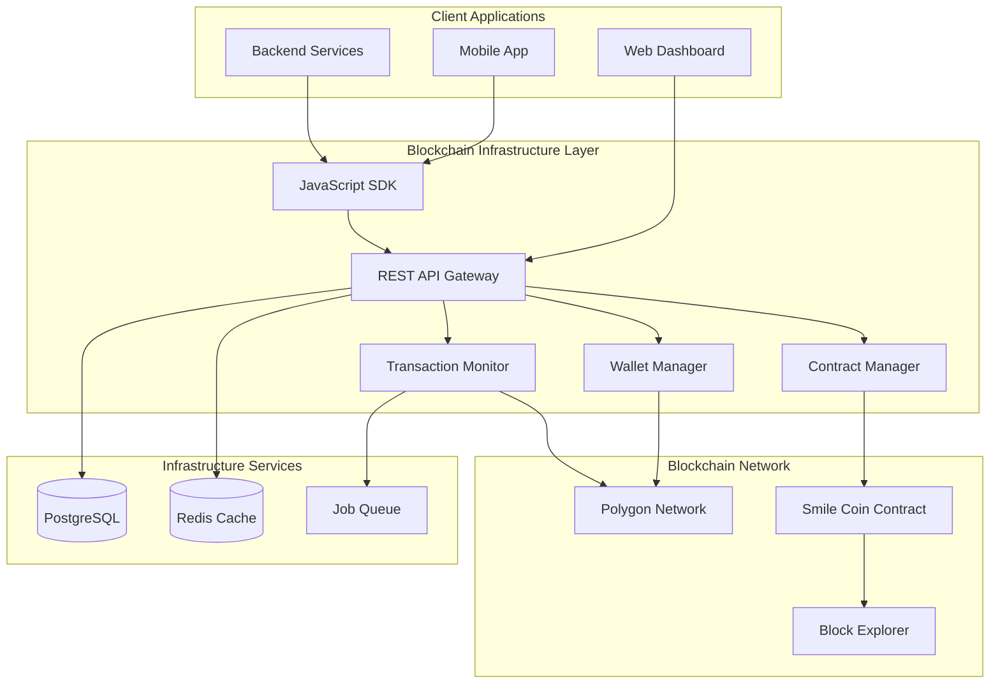

# Design Document - Tourist Rewards Blockchain Infrastructure

## Overview

The Tourist Rewards Blockchain Infrastructure provides a cost-effective, developer-friendly abstraction layer for blockchain operations specific to the smile coin system. This infrastructure handles wallet management, smart contract interactions, transaction processing, and provides simple REST APIs and SDKs for backend developers to integrate blockchain functionality without dealing with blockchain complexity.

The system is designed to support the Tourist Rewards System by providing reliable, cheap, and easy-to-use blockchain services while maintaining transparency and immutability of smile coin transactions.

## Architecture

### High-Level Architecture



### Technology Stack

**Blockchain Network:**
- Polygon (MATIC) - Low-cost EVM-compatible network
- Average transaction cost: ~$0.001-0.01 USD
- Fast confirmation times: 2-3 seconds
- High throughput: 7,000+ TPS

**Smart Contracts:**
- Solidity 0.8.19+
- OpenZeppelin contracts for security
- Upgradeable proxy pattern for contract evolution
- Automated testing with Hardhat

**API Layer:**
- Node.js with Express.js
- TypeScript for type safety
- Swagger/OpenAPI documentation
- Rate limiting with express-rate-limit

**SDK:**
- JavaScript/TypeScript SDK
- Promise-based async operations
- Built-in error handling and retries
- Comprehensive TypeScript definitions

**Infrastructure:**
- PostgreSQL for transaction indexing
- Redis for caching and job queues
- Docker containers for deployment
- Automated deployment scripts

## Components and Interfaces

### 1. Smart Contract System

#### Smile Coin Contract

```solidity
// SPDX-License-Identifier: MIT
pragma solidity ^0.8.19;

import "@openzeppelin/contracts-upgradeable/token/ERC20/ERC20Upgradeable.sol";
import "@openzeppelin/contracts-upgradeable/access/OwnableUpgradeable.sol";
import "@openzeppelin/contracts-upgradeable/proxy/utils/Initializable.sol";

contract SmileCoin is Initializable, ERC20Upgradeable, OwnableUpgradeable {
    struct TouristData {
        string originCountry;
        uint256 arrivalTimestamp;
        uint256 departureTimestamp;
        uint256 lastDailyMint;
        uint256 totalDailyMints;
        bool physicalCoinEligible;
    }

    struct RestaurantData {
        string googlePlaceId;
        uint256 totalCoinsReceived;
        mapping(address => mapping(uint256 => uint256)) dailyCoinsFromTourist; // tourist => day => coins
    }

    struct CoinData {
        uint256 mintTimestamp;
        uint256 expirationTimestamp;
        string touristOrigin;
    }

    mapping(address => TouristData) public tourists;
    mapping(address => RestaurantData) public restaurants;
    mapping(uint256 => CoinData) public coinMetadata; // tokenId => metadata
    
    uint256 public constant DAILY_COIN_AMOUNT = 10 * 10**18; // 10 coins
    uint256 public constant COIN_EXPIRATION_DAYS = 14;
    uint256 public constant MAX_COINS_PER_RESTAURANT_PER_DAY = 3 * 10**18; // 3 coins
    uint256 private _tokenIdCounter;

    event DailyCoinsIssued(address indexed tourist, uint256 amount, string originCountry);
    event CoinsTransferred(address indexed from, address indexed to, uint256 amount, string restaurantId);
    event CoinsExpired(address indexed tourist, uint256 amount);
    event PhysicalCoinEligibilityUpdated(address indexed tourist, bool eligible);

    function initialize() public initializer {
        __ERC20_init("Smile Coin", "SMILE");
        __Ownable_init();
    }

    function registerTourist(
        address tourist,
        string memory originCountry,
        uint256 arrivalTimestamp,
        uint256 departureTimestamp
    ) external onlyOwner {
        tourists[tourist] = TouristData({
            originCountry: originCountry,
            arrivalTimestamp: arrivalTimestamp,
            departureTimestamp: departureTimestamp,
            lastDailyMint: 0,
            totalDailyMints: 0,
            physicalCoinEligible: false
        });
    }

    function registerRestaurant(
        address restaurant,
        string memory googlePlaceId
    ) external onlyOwner {
        restaurants[restaurant].googlePlaceId = googlePlaceId;
    }

    function issueDailyCoins(address tourist) external onlyOwner {
        TouristData storage touristData = tourists[tourist];
        require(bytes(touristData.originCountry).length > 0, "Tourist not registered");
        require(block.timestamp >= touristData.arrivalTimestamp, "Tourist not arrived yet");
        require(block.timestamp <= touristData.departureTimestamp, "Tourist departure passed");
        
        uint256 today = block.timestamp / 1 days;
        require(touristData.lastDailyMint < today, "Daily coins already issued today");

        // Mint coins with expiration metadata
        for (uint256 i = 0; i < 10; i++) {
            uint256 tokenId = _tokenIdCounter++;
            coinMetadata[tokenId] = CoinData({
                mintTimestamp: block.timestamp,
                expirationTimestamp: block.timestamp + (COIN_EXPIRATION_DAYS * 1 days),
                touristOrigin: touristData.originCountry
            });
        }

        _mint(tourist, DAILY_COIN_AMOUNT);
        touristData.lastDailyMint = today;
        touristData.totalDailyMints++;

        emit DailyCoinsIssued(tourist, DAILY_COIN_AMOUNT, touristData.originCountry);
    }

    function transferToRestaurant(
        address restaurant,
        uint256 amount,
        string memory googlePlaceId
    ) external {
        require(amount <= MAX_COINS_PER_RESTAURANT_PER_DAY, "Exceeds daily limit per restaurant");
        require(bytes(restaurants[restaurant].googlePlaceId).length > 0, "Restaurant not registered");
        
        uint256 today = block.timestamp / 1 days;
        uint256 dailyTransferred = restaurants[restaurant].dailyCoinsFromTourist[msg.sender][today];
        require(dailyTransferred + amount <= MAX_COINS_PER_RESTAURANT_PER_DAY, "Daily limit exceeded");

        _transfer(msg.sender, restaurant, amount);
        
        restaurants[restaurant].dailyCoinsFromTourist[msg.sender][today] += amount;
        restaurants[restaurant].totalCoinsReceived += amount;

        emit CoinsTransferred(msg.sender, restaurant, amount, googlePlaceId);
    }

    function burnExpiredCoins(address holder) external onlyOwner {
        // Implementation for burning expired coins
        // This would be called by automated process
    }

    function checkPhysicalCoinEligibility(address tourist) external view returns (bool) {
        TouristData memory touristData = tourists[tourist];
        uint256 daysSinceArrival = (block.timestamp - touristData.arrivalTimestamp) / 1 days;
        return touristData.totalDailyMints >= daysSinceArrival && daysSinceArrival > 0;
    }
}
```

### 2. REST API Layer

#### API Endpoints

```typescript
// Tourist Operations
interface TouristAPI {
  // POST /api/tourists/register
  registerTourist(data: {
    touristId: string;
    originCountry: string;
    arrivalDate: string;
    departureDate: string;
  }): Promise<{ walletAddress: string; success: boolean }>;

  // POST /api/tourists/{touristId}/daily-coins
  issueDailyCoins(touristId: string): Promise<{
    transactionHash: string;
    amount: number;
    expirationDate: string;
  }>;

  // GET /api/tourists/{touristId}/balance
  getTouristBalance(touristId: string): Promise<{
    balance: number;
    walletAddress: string;
    transactions: Transaction[];
  }>;
}

// Restaurant Operations
interface RestaurantAPI {
  // POST /api/restaurants/register
  registerRestaurant(data: {
    googlePlaceId: string;
    name: string;
    address: string;
  }): Promise<{ walletAddress: string; qrCode: string }>;

  // POST /api/restaurants/{restaurantId}/receive-coins
  receiveCoins(data: {
    touristId: string;
    restaurantId: string;
    amount: number;
  }): Promise<{ transactionHash: string; success: boolean }>;

  // GET /api/restaurants/{restaurantId}/earnings
  getRestaurantEarnings(restaurantId: string): Promise<{
    totalCoins: number;
    dailyBreakdown: DailyEarnings[];
    originBreakdown: OriginEarnings[];
  }>;
}

// Blockchain Operations
interface BlockchainAPI {
  // GET /api/blockchain/transaction/{hash}
  getTransactionStatus(hash: string): Promise<{
    status: 'pending' | 'confirmed' | 'failed';
    blockNumber?: number;
    gasUsed?: number;
    explorerUrl: string;
  }>;

  // GET /api/blockchain/network/status
  getNetworkStatus(): Promise<{
    network: string;
    blockNumber: number;
    gasPrice: string;
    isHealthy: boolean;
  }>;
}
```

#### API Implementation

```typescript
// src/api/routes/tourists.ts
import express from 'express';
import { WalletManager } from '../services/WalletManager';
import { ContractManager } from '../services/ContractManager';

const router = express.Router();

router.post('/register', async (req, res) => {
  try {
    const { touristId, originCountry, arrivalDate, departureDate } = req.body;
    
    // Generate wallet for tourist
    const wallet = await WalletManager.createWallet(touristId);
    
    // Register on blockchain
    const tx = await ContractManager.registerTourist(
      wallet.address,
      originCountry,
      new Date(arrivalDate).getTime() / 1000,
      new Date(departureDate).getTime() / 1000
    );

    res.json({
      walletAddress: wallet.address,
      transactionHash: tx.hash,
      success: true
    });
  } catch (error) {
    res.status(500).json({ error: error.message });
  }
});

router.post('/:touristId/daily-coins', async (req, res) => {
  try {
    const { touristId } = req.params;
    const wallet = await WalletManager.getWallet(touristId);
    
    const tx = await ContractManager.issueDailyCoins(wallet.address);
    
    res.json({
      transactionHash: tx.hash,
      amount: 10,
      expirationDate: new Date(Date.now() + 14 * 24 * 60 * 60 * 1000).toISOString()
    });
  } catch (error) {
    res.status(500).json({ error: error.message });
  }
});

export default router;
```

### 3. JavaScript SDK

#### SDK Interface

```typescript
// src/sdk/SmileCoinSDK.ts
export class SmileCoinSDK {
  private apiUrl: string;
  private apiKey: string;

  constructor(config: { apiUrl: string; apiKey: string }) {
    this.apiUrl = config.apiUrl;
    this.apiKey = config.apiKey;
  }

  // Tourist operations
  async registerTourist(data: TouristRegistration): Promise<TouristWallet> {
    const response = await this.request('POST', '/tourists/register', data);
    return response.data;
  }

  async issueDailyCoins(touristId: string): Promise<CoinIssuance> {
    const response = await this.request('POST', `/tourists/${touristId}/daily-coins`);
    return response.data;
  }

  async getTouristBalance(touristId: string): Promise<TouristBalance> {
    const response = await this.request('GET', `/tourists/${touristId}/balance`);
    return response.data;
  }

  // Restaurant operations
  async registerRestaurant(data: RestaurantRegistration): Promise<RestaurantWallet> {
    const response = await this.request('POST', '/restaurants/register', data);
    return response.data;
  }

  async transferCoins(data: CoinTransfer): Promise<TransferResult> {
    const response = await this.request('POST', `/restaurants/${data.restaurantId}/receive-coins`, data);
    return response.data;
  }

  async getRestaurantEarnings(restaurantId: string): Promise<RestaurantEarnings> {
    const response = await this.request('GET', `/restaurants/${restaurantId}/earnings`);
    return response.data;
  }

  // Blockchain operations
  async getTransactionStatus(hash: string): Promise<TransactionStatus> {
    const response = await this.request('GET', `/blockchain/transaction/${hash}`);
    return response.data;
  }

  async getNetworkStatus(): Promise<NetworkStatus> {
    const response = await this.request('GET', '/blockchain/network/status');
    return response.data;
  }

  private async request(method: string, endpoint: string, data?: any): Promise<any> {
    const url = `${this.apiUrl}/api${endpoint}`;
    const options: RequestInit = {
      method,
      headers: {
        'Content-Type': 'application/json',
        'Authorization': `Bearer ${this.apiKey}`,
      },
    };

    if (data) {
      options.body = JSON.stringify(data);
    }

    const response = await fetch(url, options);
    
    if (!response.ok) {
      throw new Error(`API request failed: ${response.statusText}`);
    }

    return response.json();
  }
}

// Usage example
const sdk = new SmileCoinSDK({
  apiUrl: 'http://localhost:3000',
  apiKey: 'your-api-key'
});

// Register a tourist
const tourist = await sdk.registerTourist({
  touristId: 'tourist-123',
  originCountry: 'USA',
  arrivalDate: '2024-01-15',
  departureDate: '2024-01-22'
});

// Issue daily coins
const coins = await sdk.issueDailyCoins('tourist-123');

// Transfer coins to restaurant
const transfer = await sdk.transferCoins({
  touristId: 'tourist-123',
  restaurantId: 'restaurant-456',
  amount: 3
});
```

### 4. Wallet Management System

```typescript
// src/services/WalletManager.ts
import { ethers } from 'ethers';
import { encrypt, decrypt } from '../utils/encryption';

export class WalletManager {
  private static wallets = new Map<string, ethers.Wallet>();
  private static provider: ethers.Provider;

  static initialize(rpcUrl: string) {
    this.provider = new ethers.JsonRpcProvider(rpcUrl);
  }

  static async createWallet(userId: string): Promise<{ address: string; privateKey: string }> {
    // Generate deterministic wallet from user ID
    const seed = ethers.keccak256(ethers.toUtf8Bytes(userId + process.env.WALLET_SEED));
    const wallet = new ethers.Wallet(seed, this.provider);
    
    // Store encrypted private key
    const encryptedKey = encrypt(wallet.privateKey);
    await this.storeWallet(userId, wallet.address, encryptedKey);
    
    this.wallets.set(userId, wallet);
    
    return {
      address: wallet.address,
      privateKey: wallet.privateKey
    };
  }

  static async getWallet(userId: string): Promise<ethers.Wallet> {
    if (this.wallets.has(userId)) {
      return this.wallets.get(userId)!;
    }

    // Load from database
    const walletData = await this.loadWallet(userId);
    const privateKey = decrypt(walletData.encryptedPrivateKey);
    const wallet = new ethers.Wallet(privateKey, this.provider);
    
    this.wallets.set(userId, wallet);
    return wallet;
  }

  static async fundWallet(address: string, amount: string): Promise<string> {
    // Fund wallet with MATIC for gas fees
    const adminWallet = new ethers.Wallet(process.env.ADMIN_PRIVATE_KEY!, this.provider);
    const tx = await adminWallet.sendTransaction({
      to: address,
      value: ethers.parseEther(amount)
    });
    return tx.hash;
  }

  private static async storeWallet(userId: string, address: string, encryptedKey: string) {
    // Store in database
    // Implementation depends on database choice
  }

  private static async loadWallet(userId: string) {
    // Load from database
    // Implementation depends on database choice
  }
}
```

### 5. Contract Management System

```typescript
// src/services/ContractManager.ts
import { ethers } from 'ethers';
import { WalletManager } from './WalletManager';
import SmileCoinABI from '../contracts/SmileCoin.json';

export class ContractManager {
  private static contract: ethers.Contract;
  private static adminWallet: ethers.Wallet;

  static initialize(contractAddress: string, rpcUrl: string) {
    const provider = new ethers.JsonRpcProvider(rpcUrl);
    this.adminWallet = new ethers.Wallet(process.env.ADMIN_PRIVATE_KEY!, provider);
    this.contract = new ethers.Contract(contractAddress, SmileCoinABI.abi, this.adminWallet);
  }

  static async registerTourist(
    address: string,
    originCountry: string,
    arrivalTimestamp: number,
    departureTimestamp: number
  ): Promise<ethers.TransactionResponse> {
    const tx = await this.contract.registerTourist(
      address,
      originCountry,
      arrivalTimestamp,
      departureTimestamp
    );
    return tx;
  }

  static async issueDailyCoins(touristAddress: string): Promise<ethers.TransactionResponse> {
    const tx = await this.contract.issueDailyCoins(touristAddress);
    return tx;
  }

  static async transferToRestaurant(
    touristId: string,
    restaurantAddress: string,
    amount: number,
    googlePlaceId: string
  ): Promise<ethers.TransactionResponse> {
    const touristWallet = await WalletManager.getWallet(touristId);
    const contractWithTourist = this.contract.connect(touristWallet);
    
    const tx = await contractWithTourist.transferToRestaurant(
      restaurantAddress,
      ethers.parseEther(amount.toString()),
      googlePlaceId
    );
    return tx;
  }

  static async getBalance(address: string): Promise<number> {
    const balance = await this.contract.balanceOf(address);
    return parseFloat(ethers.formatEther(balance));
  }

  static async getTouristData(address: string) {
    return await this.contract.tourists(address);
  }

  static async getRestaurantData(address: string) {
    return await this.contract.restaurants(address);
  }
}
```

## Data Models

### Database Schema

```sql
-- Wallets table for mapping user IDs to blockchain addresses
CREATE TABLE wallets (
    id UUID PRIMARY KEY DEFAULT gen_random_uuid(),
    user_id VARCHAR(255) UNIQUE NOT NULL,
    user_type VARCHAR(50) NOT NULL, -- 'tourist' or 'restaurant'
    wallet_address VARCHAR(42) UNIQUE NOT NULL,
    encrypted_private_key TEXT NOT NULL,
    created_at TIMESTAMP DEFAULT NOW(),
    updated_at TIMESTAMP DEFAULT NOW()
);

-- Transaction indexing for fast queries
CREATE TABLE blockchain_transactions (
    id UUID PRIMARY KEY DEFAULT gen_random_uuid(),
    transaction_hash VARCHAR(66) UNIQUE NOT NULL,
    block_number BIGINT NOT NULL,
    from_address VARCHAR(42) NOT NULL,
    to_address VARCHAR(42) NOT NULL,
    amount DECIMAL(36, 18) NOT NULL,
    gas_used BIGINT,
    gas_price DECIMAL(36, 18),
    transaction_fee DECIMAL(36, 18),
    status VARCHAR(20) NOT NULL, -- 'pending', 'confirmed', 'failed'
    transaction_type VARCHAR(50) NOT NULL, -- 'daily_issuance', 'restaurant_transfer', 'expiration'
    metadata JSONB, -- Additional data like origin country, restaurant ID
    created_at TIMESTAMP DEFAULT NOW(),
    confirmed_at TIMESTAMP
);

-- API usage tracking
CREATE TABLE api_usage (
    id UUID PRIMARY KEY DEFAULT gen_random_uuid(),
    api_key_id UUID NOT NULL,
    endpoint VARCHAR(255) NOT NULL,
    method VARCHAR(10) NOT NULL,
    status_code INTEGER NOT NULL,
    response_time_ms INTEGER,
    created_at TIMESTAMP DEFAULT NOW()
);

-- Network monitoring
CREATE TABLE network_status (
    id UUID PRIMARY KEY DEFAULT gen_random_uuid(),
    network_name VARCHAR(50) NOT NULL,
    block_number BIGINT NOT NULL,
    gas_price DECIMAL(36, 18) NOT NULL,
    is_healthy BOOLEAN NOT NULL,
    response_time_ms INTEGER,
    created_at TIMESTAMP DEFAULT NOW()
);

CREATE INDEX idx_transactions_hash ON blockchain_transactions(transaction_hash);
CREATE INDEX idx_transactions_addresses ON blockchain_transactions(from_address, to_address);
CREATE INDEX idx_transactions_status ON blockchain_transactions(status);
CREATE INDEX idx_transactions_type ON blockchain_transactions(transaction_type);
CREATE INDEX idx_wallets_user_id ON wallets(user_id);
CREATE INDEX idx_wallets_address ON wallets(wallet_address);
```

## Error Handling

### Blockchain-Specific Errors

```typescript
export enum BlockchainErrorCode {
  INSUFFICIENT_BALANCE = 'INSUFFICIENT_BALANCE',
  DAILY_LIMIT_EXCEEDED = 'DAILY_LIMIT_EXCEEDED',
  TOURIST_NOT_REGISTERED = 'TOURIST_NOT_REGISTERED',
  RESTAURANT_NOT_REGISTERED = 'RESTAURANT_NOT_REGISTERED',
  COINS_EXPIRED = 'COINS_EXPIRED',
  TRANSACTION_FAILED = 'TRANSACTION_FAILED',
  NETWORK_ERROR = 'NETWORK_ERROR',
  GAS_LIMIT_EXCEEDED = 'GAS_LIMIT_EXCEEDED',
  INVALID_AMOUNT = 'INVALID_AMOUNT',
  WALLET_NOT_FOUND = 'WALLET_NOT_FOUND'
}

export class BlockchainError extends Error {
  constructor(
    public code: BlockchainErrorCode,
    public message: string,
    public details?: any
  ) {
    super(message);
    this.name = 'BlockchainError';
  }
}

// Error handling middleware
export const errorHandler = (error: any, req: any, res: any, next: any) => {
  if (error instanceof BlockchainError) {
    return res.status(400).json({
      error: {
        code: error.code,
        message: error.message,
        details: error.details
      }
    });
  }

  // Handle ethers.js errors
  if (error.code === 'INSUFFICIENT_FUNDS') {
    return res.status(400).json({
      error: {
        code: BlockchainErrorCode.INSUFFICIENT_BALANCE,
        message: 'Insufficient balance for transaction'
      }
    });
  }

  return res.status(500).json({
    error: {
      code: 'INTERNAL_ERROR',
      message: 'Internal server error'
    }
  });
};
```

## Testing Strategy

### Smart Contract Testing

```typescript
// test/SmileCoin.test.ts
import { expect } from 'chai';
import { ethers } from 'hardhat';
import { SmileCoin } from '../typechain-types';

describe('SmileCoin Contract', () => {
  let smileCoin: SmileCoin;
  let owner: any, tourist: any, restaurant: any;

  beforeEach(async () => {
    [owner, tourist, restaurant] = await ethers.getSigners();
    
    const SmileCoinFactory = await ethers.getContractFactory('SmileCoin');
    smileCoin = await SmileCoinFactory.deploy();
    await smileCoin.initialize();
  });

  describe('Tourist Registration', () => {
    it('should register tourist with correct data', async () => {
      const arrivalTime = Math.floor(Date.now() / 1000);
      const departureTime = arrivalTime + (7 * 24 * 60 * 60); // 7 days later

      await smileCoin.registerTourist(
        tourist.address,
        'USA',
        arrivalTime,
        departureTime
      );

      const touristData = await smileCoin.tourists(tourist.address);
      expect(touristData.originCountry).to.equal('USA');
      expect(touristData.arrivalTimestamp).to.equal(arrivalTime);
    });
  });

  describe('Daily Coin Issuance', () => {
    it('should issue 10 coins daily', async () => {
      // Register tourist first
      const arrivalTime = Math.floor(Date.now() / 1000);
      const departureTime = arrivalTime + (7 * 24 * 60 * 60);
      
      await smileCoin.registerTourist(tourist.address, 'USA', arrivalTime, departureTime);
      
      // Issue daily coins
      await smileCoin.issueDailyCoins(tourist.address);
      
      const balance = await smileCoin.balanceOf(tourist.address);
      expect(balance).to.equal(ethers.parseEther('10'));
    });

    it('should not allow double issuance on same day', async () => {
      const arrivalTime = Math.floor(Date.now() / 1000);
      const departureTime = arrivalTime + (7 * 24 * 60 * 60);
      
      await smileCoin.registerTourist(tourist.address, 'USA', arrivalTime, departureTime);
      await smileCoin.issueDailyCoins(tourist.address);
      
      await expect(
        smileCoin.issueDailyCoins(tourist.address)
      ).to.be.revertedWith('Daily coins already issued today');
    });
  });

  describe('Restaurant Transfers', () => {
    it('should transfer coins to restaurant with limits', async () => {
      // Setup
      const arrivalTime = Math.floor(Date.now() / 1000);
      const departureTime = arrivalTime + (7 * 24 * 60 * 60);
      
      await smileCoin.registerTourist(tourist.address, 'USA', arrivalTime, departureTime);
      await smileCoin.registerRestaurant(restaurant.address, 'place_id_123');
      await smileCoin.issueDailyCoins(tourist.address);
      
      // Transfer 3 coins (max daily limit)
      await smileCoin.connect(tourist).transferToRestaurant(
        restaurant.address,
        ethers.parseEther('3'),
        'place_id_123'
      );
      
      const restaurantBalance = await smileCoin.balanceOf(restaurant.address);
      expect(restaurantBalance).to.equal(ethers.parseEther('3'));
    });

    it('should enforce daily transfer limits', async () => {
      // Setup similar to above test
      const arrivalTime = Math.floor(Date.now() / 1000);
      const departureTime = arrivalTime + (7 * 24 * 60 * 60);
      
      await smileCoin.registerTourist(tourist.address, 'USA', arrivalTime, departureTime);
      await smileCoin.registerRestaurant(restaurant.address, 'place_id_123');
      await smileCoin.issueDailyCoins(tourist.address);
      
      // First transfer of 3 coins should succeed
      await smileCoin.connect(tourist).transferToRestaurant(
        restaurant.address,
        ethers.parseEther('3'),
        'place_id_123'
      );
      
      // Second transfer should fail
      await expect(
        smileCoin.connect(tourist).transferToRestaurant(
          restaurant.address,
          ethers.parseEther('1'),
          'place_id_123'
        )
      ).to.be.revertedWith('Daily limit exceeded');
    });
  });
});
```

### API Integration Testing

```typescript
// test/api.test.ts
import request from 'supertest';
import { app } from '../src/app';

describe('Tourist API', () => {
  describe('POST /api/tourists/register', () => {
    it('should register a new tourist', async () => {
      const response = await request(app)
        .post('/api/tourists/register')
        .send({
          touristId: 'test-tourist-1',
          originCountry: 'USA',
          arrivalDate: '2024-01-15',
          departureDate: '2024-01-22'
        })
        .expect(200);

      expect(response.body).toHaveProperty('walletAddress');
      expect(response.body).toHaveProperty('transactionHash');
      expect(response.body.success).toBe(true);
    });
  });

  describe('POST /api/tourists/:touristId/daily-coins', () => {
    it('should issue daily coins', async () => {
      // First register tourist
      await request(app)
        .post('/api/tourists/register')
        .send({
          touristId: 'test-tourist-2',
          originCountry: 'Canada',
          arrivalDate: '2024-01-15',
          departureDate: '2024-01-22'
        });

      // Then issue daily coins
      const response = await request(app)
        .post('/api/tourists/test-tourist-2/daily-coins')
        .expect(200);

      expect(response.body).toHaveProperty('transactionHash');
      expect(response.body.amount).toBe(10);
    });
  });
});
```

### SDK Testing

```typescript
// test/sdk.test.ts
import { SmileCoinSDK } from '../src/sdk/SmileCoinSDK';

describe('SmileCoin SDK', () => {
  let sdk: SmileCoinSDK;

  beforeEach(() => {
    sdk = new SmileCoinSDK({
      apiUrl: 'http://localhost:3000',
      apiKey: 'test-api-key'
    });
  });

  it('should register tourist', async () => {
    const result = await sdk.registerTourist({
      touristId: 'sdk-test-1',
      originCountry: 'UK',
      arrivalDate: '2024-01-15',
      departureDate: '2024-01-22'
    });

    expect(result).toHaveProperty('walletAddress');
    expect(result).toHaveProperty('transactionHash');
  });

  it('should handle API errors gracefully', async () => {
    await expect(
      sdk.registerTourist({
        touristId: '', // Invalid data
        originCountry: 'UK',
        arrivalDate: '2024-01-15',
        departureDate: '2024-01-22'
      })
    ).rejects.toThrow();
  });
});
```

## Deployment Strategy

### Automated Deployment Script

The system includes a comprehensive deployment script that handles everything from network setup to contract deployment and service initialization.

```bash
#!/bin/bash
# deploy.sh - One-line deployment script

set -e

echo "🚀 Starting Tourist Rewards Blockchain Infrastructure Deployment"

# Configuration
NETWORK=${1:-"polygon-mumbai"}  # Default to testnet
ENVIRONMENT=${2:-"development"}

# Load environment variables
if [ -f ".env.${ENVIRONMENT}" ]; then
    source ".env.${ENVIRONMENT}"
else
    echo "❌ Environment file .env.${ENVIRONMENT} not found"
    exit 1
fi

echo "📋 Deployment Configuration:"
echo "  Network: ${NETWORK}"
echo "  Environment: ${ENVIRONMENT}"
echo "  RPC URL: ${RPC_URL}"

# Step 1: Install dependencies
echo "📦 Installing dependencies..."
npm install

# Step 2: Compile smart contracts
echo "🔨 Compiling smart contracts..."
npx hardhat compile

# Step 3: Deploy smart contracts
echo "🚀 Deploying smart contracts to ${NETWORK}..."
CONTRACT_ADDRESS=$(npx hardhat run scripts/deploy.js --network ${NETWORK} | grep "SmileCoin deployed to:" | cut -d' ' -f4)

if [ -z "$CONTRACT_ADDRESS" ]; then
    echo "❌ Contract deployment failed"
    exit 1
fi

echo "✅ SmileCoin contract deployed to: ${CONTRACT_ADDRESS}"

# Step 4: Update environment with contract address
echo "CONTRACT_ADDRESS=${CONTRACT_ADDRESS}" >> ".env.${ENVIRONMENT}"

# Step 5: Fund admin wallet with MATIC for gas
echo "💰 Funding admin wallet..."
if [ "$NETWORK" = "polygon-mumbai" ]; then
    echo "  Please fund your admin wallet manually from Mumbai faucet:"
    echo "  https://faucet.polygon.technology/"
    echo "  Admin wallet: ${ADMIN_WALLET_ADDRESS}"
    read -p "Press enter when wallet is funded..."
fi

# Step 6: Initialize database
echo "🗄️  Setting up database..."
docker-compose up -d postgres redis
sleep 5

# Run migrations
npx knex migrate:latest

# Step 7: Start API services
echo "🌐 Starting API services..."
docker-compose up -d api

# Step 8: Health checks
echo "🏥 Running health checks..."
sleep 10

# Check API health
API_HEALTH=$(curl -s -o /dev/null -w "%{http_code}" http://localhost:3000/health)
if [ "$API_HEALTH" != "200" ]; then
    echo "❌ API health check failed"
    exit 1
fi

# Check blockchain connection
BLOCKCHAIN_HEALTH=$(curl -s http://localhost:3000/api/blockchain/network/status | jq -r '.isHealthy')
if [ "$BLOCKCHAIN_HEALTH" != "true" ]; then
    echo "❌ Blockchain connection health check failed"
    exit 1
fi

# Step 9: Generate API documentation
echo "📚 Generating API documentation..."
npm run docs:generate

# Step 10: Create sample data (for development)
if [ "$ENVIRONMENT" = "development" ]; then
    echo "🎭 Creating sample data..."
    node scripts/create-sample-data.js
fi

echo "✅ Deployment completed successfully!"
echo ""
echo "📋 Deployment Summary:"
echo "  Contract Address: ${CONTRACT_ADDRESS}"
echo "  API URL: http://localhost:3000"
echo "  API Documentation: http://localhost:3000/docs"
echo "  Network Explorer: ${EXPLORER_URL}/address/${CONTRACT_ADDRESS}"
echo ""
echo "🔧 Next Steps:"
echo "  1. Update your application with the new contract address"
echo "  2. Test the API endpoints using the documentation"
echo "  3. Monitor the deployment with: docker-compose logs -f"
echo ""
echo "🎉 Your Tourist Rewards Blockchain Infrastructure is ready!"
```

### Docker Configuration

```yaml
# docker-compose.yml
version: '3.8'

services:
  postgres:
    image: postgres:15
    environment:
      POSTGRES_DB: ${DB_NAME:-tourist_rewards}
      POSTGRES_USER: ${DB_USER:-postgres}
      POSTGRES_PASSWORD: ${DB_PASSWORD:-postgres}
    ports:
      - "${DB_PORT:-5432}:5432"
    volumes:
      - postgres_data:/var/lib/postgresql/data
      - ./scripts/init.sql:/docker-entrypoint-initdb.d/init.sql

  redis:
    image: redis:7-alpine
    ports:
      - "${REDIS_PORT:-6379}:6379"
    volumes:
      - redis_data:/data

  api:
    build: .
    ports:
      - "${API_PORT:-3000}:3000"
    environment:
      - NODE_ENV=${NODE_ENV:-development}
      - DATABASE_URL=postgresql://${DB_USER:-postgres}:${DB_PASSWORD:-postgres}@postgres:5432/${DB_NAME:-tourist_rewards}
      - REDIS_URL=redis://redis:6379
      - CONTRACT_ADDRESS=${CONTRACT_ADDRESS}
      - RPC_URL=${RPC_URL}
      - ADMIN_PRIVATE_KEY=${ADMIN_PRIVATE_KEY}
    depends_on:
      - postgres
      - redis
    volumes:
      - ./logs:/app/logs

  monitor:
    build: 
      context: .
      dockerfile: Dockerfile.monitor
    environment:
      - DATABASE_URL=postgresql://${DB_USER:-postgres}:${DB_PASSWORD:-postgres}@postgres:5432/${DB_NAME:-tourist_rewards}
      - CONTRACT_ADDRESS=${CONTRACT_ADDRESS}
      - RPC_URL=${RPC_URL}
    depends_on:
      - postgres
      - api

volumes:
  postgres_data:
  redis_data:
```

### Environment Configuration

```bash
# .env.development
NODE_ENV=development
API_PORT=3000

# Database
DB_NAME=tourist_rewards_dev
DB_USER=postgres
DB_PASSWORD=postgres
DB_PORT=5432

# Redis
REDIS_PORT=6379

# Blockchain
NETWORK=polygon-mumbai
RPC_URL=https://rpc-mumbai.maticvigil.com
CONTRACT_ADDRESS=  # Will be populated by deployment script
ADMIN_PRIVATE_KEY=your_admin_private_key_here
ADMIN_WALLET_ADDRESS=your_admin_wallet_address_here

# API
API_KEY_SECRET=your_secret_key_here
JWT_SECRET=your_jwt_secret_here

# Monitoring
EXPLORER_URL=https://mumbai.polygonscan.com

# Wallet encryption
WALLET_SEED=your_wallet_seed_here
ENCRYPTION_KEY=your_encryption_key_here
```

```bash
# .env.production
NODE_ENV=production
API_PORT=3000

# Database
DB_NAME=tourist_rewards_prod
DB_USER=postgres
DB_PASSWORD=secure_production_password
DB_PORT=5432

# Redis
REDIS_PORT=6379

# Blockchain
NETWORK=polygon-mainnet
RPC_URL=https://polygon-rpc.com
CONTRACT_ADDRESS=  # Will be populated by deployment script
ADMIN_PRIVATE_KEY=production_admin_private_key
ADMIN_WALLET_ADDRESS=production_admin_wallet_address

# API
API_KEY_SECRET=production_secret_key
JWT_SECRET=production_jwt_secret

# Monitoring
EXPLORER_URL=https://polygonscan.com

# Wallet encryption
WALLET_SEED=production_wallet_seed
ENCRYPTION_KEY=production_encryption_key
```

### Deployment Commands

```bash
# Development deployment (testnet)
./deploy.sh polygon-mumbai development

# Production deployment (mainnet)
./deploy.sh polygon-mainnet production

# Local development with Hardhat network
./deploy.sh localhost development

# Update existing deployment
./deploy.sh polygon-mumbai development --update

# Rollback deployment
./rollback.sh polygon-mumbai development
```

This comprehensive design provides a robust, scalable, and developer-friendly blockchain infrastructure specifically tailored for the Tourist Rewards System, with automated deployment capabilities and extensive testing coverage.