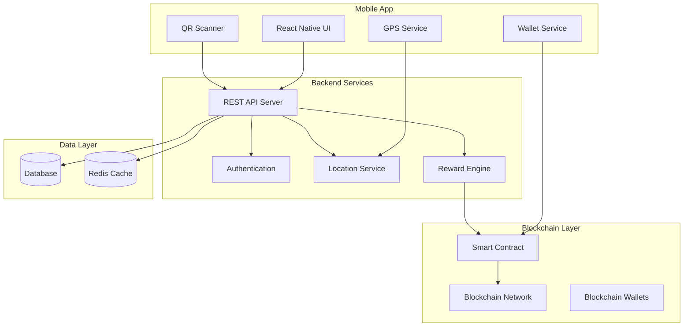

# Design Document - Tourist Rewards System

## Overview

The Tourist Rewards System is a mobile application that leverages blockchain technology to create a transparent and gamified experience for tourists to appreciate restaurants in Hong Kong. The system combines location-based services, blockchain transactions, and reward mechanics to encourage positive tourist-restaurant interactions.

## Architecture

### High-Level Architecture



### Technology Stack

**Frontend:**
- React Native (cross-platform mobile app)
- NativeWind (Tailwind CSS for React Native)
- React Navigation (navigation)
- React Native Maps (GPS and location display)
- React Native QR Code Scanner
- Web3.js or Ethers.js (blockchain interaction)

**External APIs:**
- Google Maps Places API (restaurant discovery)
- Google Maps Geocoding API (address resolution)
- Google Maps Distance Matrix API (distance calculations)

**Backend:**
- Node.js with Express.js
- PostgreSQL (primary database)
- Redis (caching and session management)
- JWT (authentication)
- Google Maps API (restaurant data and locations)

**Restaurant Web Dashboard:**
- React.js (web dashboard for restaurants)
- Tailwind CSS (styling and responsive design)
- Chart.js or D3.js (data visualization)
- Responsive design for mobile/desktop access

**Blockchain:**
- Ethereum testnet (for hackathon demo)
- Solidity smart contracts
- MetaMask integration or custom wallet
- IPFS (optional for metadata storage)

**Infrastructure:**
- Docker containers
- Cloud deployment (AWS/GCP/Azure)
- Blockchain node connection (Infura/Alchemy)

## Components and Interfaces

### Mobile App Components

#### 1. Page Structure
```typescript
interface AppPages {
  Dashboard: 'Overall restaurant rankings and statistics'
  NearbyRestaurants: 'GPS-based restaurant discovery'
  Recommendations: 'Origin-based restaurant suggestions'
  Profile: 'User profile and coin balance'
  QRScanner: 'In-restaurant QR code scanning only'
}
```

#### 2. Authentication Module
```typescript
interface AuthService {
  register(userData: TouristRegistration): Promise<AuthResult>
  login(credentials: LoginCredentials): Promise<AuthResult>
  logout(): Promise<void>
  getCurrentUser(): Promise<User>
}

interface TouristRegistration {
  name: string
  email: string
  originCountry: string
  arrivalDate: Date
  departureDate: Date
  walletAddress?: string
}
```

#### 3. Location Service (Google Maps Integration)
```typescript
interface LocationService {
  getCurrentLocation(): Promise<Coordinates>
  getNearbyRestaurants(location: Coordinates, radius: number): Promise<GoogleRestaurant[]>
  getRestaurantDetails(placeId: string): Promise<GoogleRestaurant>
  calculateDistance(from: Coordinates, to: Coordinates): number
}

interface GoogleRestaurant {
  placeId: string
  name: string
  address: string
  location: Coordinates
  rating: number
  priceLevel: number
  photos: string[]
  isOpen: boolean
}

interface Coordinates {
  latitude: number
  longitude: number
}
```

#### 4. Blockchain Wallet Service
```typescript
interface WalletService {
  createWallet(): Promise<WalletInfo>
  getBalance(): Promise<number>
  sendCoins(toAddress: string, amount: number, restaurantId: string): Promise<Transaction>
  getTransactionHistory(): Promise<Transaction[]>
}

interface Transaction {
  hash: string
  from: string
  to: string
  amount: number
  timestamp: Date
  restaurantId: string
  blockNumber: number
}
```

#### 5. QR Code Service (In-Restaurant Only)
```typescript
interface QRService {
  scanQRCode(): Promise<QRData>  // Only works when physically inside restaurant
  generateRestaurantQR(googlePlaceId: string): Promise<string>
}

interface QRData {
  googlePlaceId: string
  restaurantName: string
  walletAddress: string
}

// QR codes are NOT displayed in the app - only physical codes in restaurants
```

### Restaurant Web Dashboard Components

#### Restaurant Dashboard Service
```typescript
interface RestaurantDashboardService {
  getDailyStats(googlePlaceId: string): Promise<DailyStats[]>
  getTotalStats(googlePlaceId: string): Promise<TotalStats>
  getOriginBreakdown(googlePlaceId: string): Promise<OriginStats[]>
  getPerformanceTrends(googlePlaceId: string): Promise<TrendData>
  getRankingPosition(googlePlaceId: string): Promise<RankingInfo>
}

interface DailyStats {
  date: Date
  coinsReceived: number
  uniqueTourists: number
  transactions: number
}

interface TotalStats {
  totalCoins: number
  totalTransactions: number
  averageCoinsPerDay: number
  rankingPosition: number
  totalRestaurants: number
}

interface OriginStats {
  country: string
  coinsReceived: number
  touristCount: number
  percentage: number
}
```

### Backend API Endpoints

#### Authentication Endpoints
```
POST /api/auth/register
POST /api/auth/login
POST /api/auth/logout
GET /api/auth/profile
```

#### Restaurant Endpoints
```
GET /api/restaurants/nearby?lat={lat}&lng={lng}&radius={radius}  // Uses Google Maps API
GET /api/restaurants/{id}
GET /api/restaurants/rankings/global  // Overall rankings for dashboard
GET /api/restaurants/rankings/origin?country={country}  // Origin-based recommendations
POST /api/restaurants/{id}/coins


// Restaurant Web Dashboard
GET /api/restaurants/{id}/dashboard/stats  // Daily, total stats
GET /api/restaurants/{id}/dashboard/origins  // Tourist origin breakdown
GET /api/restaurants/{id}/dashboard/trends  // Performance trends
```

#### User Endpoints
```
GET /api/users/profile
GET /api/users/transactions
GET /api/users/rewards/progress
POST /api/users/daily-checkin
```

#### Blockchain Endpoints
```
POST /api/blockchain/transfer
GET /api/blockchain/balance/{address}
GET /api/blockchain/transactions/{address}
POST /api/blockchain/verify-transaction
```

### Smart Contract Interface

```solidity
contract SmileCoinSystem {
    struct Tourist {
        string originCountry;
        uint256 arrivalTimestamp;
        uint256 departureTimestamp;
        uint256 dailyCoinsReceived;
        uint256 totalCoinsGiven;
        bool physicalCoinEligible;
    }
    
    struct Restaurant {
        string name;
        string location;
        uint256 totalCoinsReceived;
        mapping(uint256 => uint256) dailyCoins;  // day => coins
        mapping(uint256 => uint256) weeklyCoins; // week => coins
        mapping(uint256 => uint256) monthlyCoins; // month => coins
    }
    
    function registerTourist(string memory originCountry, uint256 departureTimestamp) external;
    function dailyCoinDistribution() external;
    function giveCoinsToRestaurant(address restaurantAddress, uint256 amount) external;
    function checkPhysicalCoinEligibility(address tourist) external view returns (bool);
    function getRestaurantRanking(uint256 period) external view returns (address[] memory);
    function expireCoins() external; // Called by automated process
}
```

## Data Models

### Database Schema

#### Users Table
```sql
CREATE TABLE users (
    id UUID PRIMARY KEY DEFAULT gen_random_uuid(),
    email VARCHAR(255) UNIQUE NOT NULL,
    name VARCHAR(255) NOT NULL,
    origin_country VARCHAR(100) NOT NULL,
    arrival_date TIMESTAMP NOT NULL,
    departure_date TIMESTAMP NOT NULL,
    wallet_address VARCHAR(42) UNIQUE NOT NULL,
    created_at TIMESTAMP DEFAULT NOW(),
    updated_at TIMESTAMP DEFAULT NOW()
);
```

#### Restaurants Table (Google Maps Integration)
```sql
CREATE TABLE restaurants (
    id UUID PRIMARY KEY DEFAULT gen_random_uuid(),
    google_place_id VARCHAR(255) UNIQUE NOT NULL,  -- Google Maps Place ID
    name VARCHAR(255) NOT NULL,
    address TEXT NOT NULL,
    latitude DECIMAL(10, 8) NOT NULL,
    longitude DECIMAL(11, 8) NOT NULL,
    wallet_address VARCHAR(42) UNIQUE NOT NULL,
    qr_code_data TEXT NOT NULL,
    total_coins_received INTEGER DEFAULT 0,
    daily_coins_cache JSONB DEFAULT '{}',  -- Cache for daily/weekly/monthly totals
    last_ranking_update TIMESTAMP DEFAULT NOW(),
    created_at TIMESTAMP DEFAULT NOW(),
    updated_at TIMESTAMP DEFAULT NOW()
);

CREATE INDEX idx_restaurants_place_id ON restaurants(google_place_id);
CREATE INDEX idx_restaurants_location ON restaurants USING GIST (
    ll_to_earth(latitude, longitude)
);
```

#### Transactions Table
```sql
CREATE TABLE transactions (
    id UUID PRIMARY KEY DEFAULT gen_random_uuid(),
    blockchain_hash VARCHAR(66) UNIQUE NOT NULL,
    from_address VARCHAR(42) NOT NULL,
    to_address VARCHAR(42) NOT NULL,
    user_id UUID REFERENCES users(id),
    restaurant_id UUID REFERENCES restaurants(id),
    amount INTEGER NOT NULL,
    transaction_date TIMESTAMP NOT NULL,
    user_origin_country VARCHAR(100) NOT NULL,  -- For origin-based recommendations
    block_number BIGINT,
    gas_used BIGINT,
    created_at TIMESTAMP DEFAULT NOW()
);

CREATE INDEX idx_transactions_user ON transactions(user_id);
CREATE INDEX idx_transactions_restaurant ON transactions(restaurant_id);
CREATE INDEX idx_transactions_date ON transactions(transaction_date);
CREATE INDEX idx_transactions_origin ON transactions(user_origin_country);
CREATE INDEX idx_transactions_restaurant_origin ON transactions(restaurant_id, user_origin_country);

-- View for restaurant analytics
CREATE VIEW restaurant_analytics AS
SELECT 
    r.id,
    r.google_place_id,
    r.name,
    COUNT(t.id) as total_transactions,
    SUM(t.amount) as total_coins,
    COUNT(DISTINCT t.user_id) as unique_tourists,
    COUNT(DISTINCT t.user_origin_country) as countries_served,
    AVG(t.amount) as avg_coins_per_transaction,
    DATE_TRUNC('day', t.transaction_date) as transaction_day
FROM restaurants r
LEFT JOIN transactions t ON r.id = t.restaurant_id
GROUP BY r.id, r.google_place_id, r.name, DATE_TRUNC('day', t.transaction_date);
```

#### Daily Rewards Table
```sql
CREATE TABLE daily_rewards (
    id UUID PRIMARY KEY DEFAULT gen_random_uuid(),
    user_id UUID REFERENCES users(id),
    reward_date DATE NOT NULL,
    coins_received INTEGER DEFAULT 10,
    coins_given INTEGER DEFAULT 0,
    all_coins_given BOOLEAN DEFAULT FALSE,
    created_at TIMESTAMP DEFAULT NOW(),
    UNIQUE(user_id, reward_date)
);
```

## Error Handling

### Blockchain Error Handling
```typescript
enum BlockchainErrorType {
  INSUFFICIENT_BALANCE = 'INSUFFICIENT_BALANCE',
  TRANSACTION_FAILED = 'TRANSACTION_FAILED',
  NETWORK_ERROR = 'NETWORK_ERROR',
  INVALID_ADDRESS = 'INVALID_ADDRESS',
  GAS_LIMIT_EXCEEDED = 'GAS_LIMIT_EXCEEDED'
}

class BlockchainError extends Error {
  constructor(
    public type: BlockchainErrorType,
    public message: string,
    public originalError?: Error
  ) {
    super(message);
  }
}
```

### API Error Responses
```typescript
interface APIError {
  error: {
    code: string;
    message: string;
    details?: any;
  };
  timestamp: string;
  path: string;
}

// Example error responses
{
  "error": {
    "code": "DAILY_LIMIT_EXCEEDED",
    "message": "Cannot give more than 3 coins per restaurant per day",
    "details": { "restaurantId": "123", "coinsGivenToday": 3 }
  },
  "timestamp": "2024-01-15T10:30:00Z",
  "path": "/api/restaurants/123/coins"
}
```

### GPS and Location Error Handling
```typescript
enum LocationErrorType {
  PERMISSION_DENIED = 'PERMISSION_DENIED',
  POSITION_UNAVAILABLE = 'POSITION_UNAVAILABLE',
  TIMEOUT = 'TIMEOUT',
  GPS_DISABLED = 'GPS_DISABLED'
}

// Fallback strategies
const locationFallbacks = {
  useLastKnownLocation: true,
  defaultToHongKongCenter: { lat: 22.3193, lng: 114.1694 },
  showLocationRequiredDialog: true
};
```

## Testing Strategy

### Unit Testing
- **Frontend**: Jest + React Native Testing Library
- **Backend**: Jest + Supertest for API testing
- **Smart Contracts**: Hardhat + Waffle for Solidity testing

### Integration Testing
- API integration tests with test database
- Blockchain integration tests with local testnet
- GPS service mocking for location-based features

### End-to-End Testing
- Detox for React Native E2E testing
- Critical user flows:
  - User registration and wallet creation
  - QR code scanning and coin transfer
  - Restaurant ranking and GPS functionality
  - Physical coin voucher generation

### Demo Testing Checklist
```markdown
- [ ] User can register with travel details
- [ ] Daily coin distribution works and shows on blockchain
- [ ] Dashboard shows overall restaurant rankings and statistics
- [ ] Nearby restaurants page uses GPS and Google Maps API
- [ ] Recommendations page shows origin-based restaurant suggestions
- [ ] QR code scanning works only inside restaurants (not in app)
- [ ] Coin transfer creates blockchain transaction with origin tracking
- [ ] Manual ranking refresh works for all pages
- [ ] Physical coin progress tracking updates
- [ ] Restaurant web dashboard shows daily stats and analytics
- [ ] Origin breakdown displays tourist countries correctly
- [ ] Blockchain explorer links work
- [ ] Restaurant data from Google Maps displays correctly
- [ ] Error handling displays user-friendly messages
```

## Security Considerations

### Blockchain Security
- Use established testnet (Goerli/Sepolia) for demo
- Implement proper gas limit controls
- Validate all smart contract interactions
- Store private keys securely (never in plain text)

### API Security
- JWT token authentication
- Rate limiting on all endpoints
- Input validation and sanitization
- CORS configuration for mobile app
- SQL injection prevention with parameterized queries

### Mobile App Security
- Secure storage for wallet private keys
- Certificate pinning for API calls
- Biometric authentication for sensitive operations
- QR code validation to prevent malicious codes

### Privacy Protection
- Hash sensitive user data
- Minimal data collection approach
- Clear data retention policies
- GDPR compliance considerations

## Performance Optimization

### Caching Strategy
- Redis cache for restaurant rankings (updated on manual refresh)
- Google Maps API response caching (24-hour TTL)
- Blockchain transaction status caching
- User session and profile caching

### Ranking Update Strategy (Simplified for Demo)
- **Manual Refresh**: Users can tap refresh button to update rankings
- **Scheduled Updates**: Mentioned as TODO feature for production
  - Daily at 12:00 AM
  - Weekly on Sundays
  - Monthly on 1st of each month
- **Demo Approach**: Mock time-based data or allow manual refresh to show ranking changes

### Database Optimization
- Proper indexing on frequently queried columns
- Connection pooling
- Query optimization for location-based searches
- Pagination for large result sets

### Mobile App Performance
- Lazy loading for restaurant lists
- Image optimization and caching
- Background sync for blockchain status
- Efficient GPS polling intervals

### Blockchain Performance
- Batch transaction processing where possible
- Gas optimization in smart contracts
- Transaction queue management
- Fallback for network congestion

## Deployment Strategy

### Development Environment (Hackathon Setup)
- Backend: localhost Node.js server (port 3000)
- PostgreSQL: Docker container (dev setup)
- Redis: Docker container (dev setup)
- Local blockchain node (Ganache) or testnet connection
- React Native development server
- Restaurant web dashboard: localhost React dev server (port 3001)

### Docker Compose Setup
```yaml
version: '3.8'
services:
  postgres:
    image: postgres:15
    environment:
      POSTGRES_DB: tourist_rewards
      POSTGRES_USER: dev
      POSTGRES_PASSWORD: dev
    ports:
      - "5432:5432"
  
  redis:
    image: redis:7
    ports:
      - "6379:6379"
```

### Demo Environment
- All services running locally on demo machine
- Mobile app connected to localhost backend
- Web dashboard accessible via localhost:3001
- Database containers managed by Docker Compose

### Monitoring and Logging
- Application performance monitoring
- Blockchain transaction monitoring
- Error tracking and alerting
- User analytics for demo insights

This design provides a comprehensive technical foundation for building the Tourist Rewards System within the 36-hour hackathon timeframe while showcasing the blockchain innovation as the key differentiator.