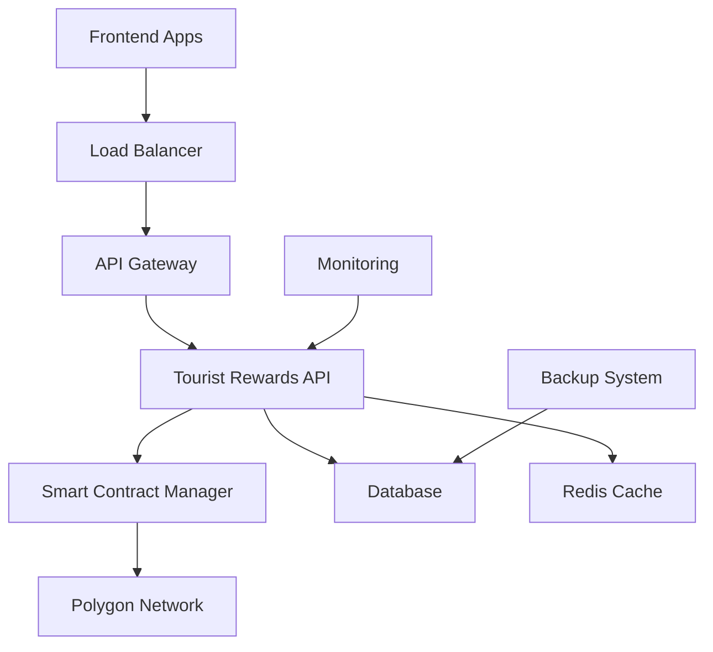

# SmileCoin Tourist Rewards Blockchain Infrastructure

A production-ready blockchain infrastructure system designed to support tourist rewards through a cost-effective, developer-friendly API/SDK. The system enables tourists to earn and spend digital coins at participating restaurants during their travels, built on Polygon for low-cost transactions.

## 🌟 Features

### Core Blockchain Features
- **SmileCoin ERC-20 Token**: Upgradeable smart contract with tourist-specific features
- **Daily Coin Issuance**: Tourists receive 10 coins daily during their stay
- **Restaurant Transfers**: Maximum 3 coins per restaurant per day with 14-day expiration
- **Wallet Management**: Automatic wallet creation for tourists and restaurants
- **Physical Coin Eligibility**: Tracking for potential physical coin rewards

### Developer Experience
- **REST API**: Comprehensive endpoints for all tourist and restaurant operations
- **JavaScript SDK**: Easy-to-use SDK for backend integration with TypeScript support
- **Interactive Documentation**: Swagger/OpenAPI documentation with live examples
- **Comprehensive Testing**: Unit, integration, E2E, and performance tests

### Production Infrastructure
- **Multi-Environment Support**: Development, staging, and production configurations
- **Monitoring & Alerting**: Prometheus, Grafana, and health check systems
- **Automated Deployment**: Scripts for testnet and production deployment
- **Security**: Rate limiting, API key authentication, and security headers
- **Scalability**: Docker containerization and load balancing ready

## 🚀 Quick Start

### Prerequisites

- Node.js 22+
- Docker and Docker Compose
- React Native development environment
- Google Maps API key
- Ethereum testnet access

### Development Setup

1. **Clone and Install**
```bash
git clone <repository-url>
cd tourist-rewards-blockchain-infrastructure
npm install
```

# Start all services with Docker (Recommended)
docker-compose up -d

# Access API documentation
open http://localhost:3001/api-docs

# Or manual setup:
# Install backend dependencies
cd backend
npm install
npm run migrate
npm run dev
2. **Environment Configuration**
```bash
cp .env.example .env.development
# Edit .env.development with your settings
```

3. **Start Infrastructure**
```bash
# Start PostgreSQL, Redis, and other services
docker-compose up -d

# Compile smart contracts
npm run compile

# Deploy to local Hardhat network
npm run deploy:local
```

4. **Start Development Server**
```bash
npm run dev
```

5. **Access Services**
- API: `http://localhost:3000`
- API Docs: `http://localhost:3000/docs`
- Health Check: `http://localhost:3000/health`

### 📚 API Documentation

Complete interactive API documentation is available via Swagger UI:

- **Local Development**: http://localhost:3001/api-docs
- **Features**: Interactive testing, authentication, complete schema definitions
- **Postman Collection**: Import from `backend/postman/Tourist-Rewards-API.postman_collection.json`

For detailed Docker setup instructions, see [DOCKER_SETUP.md](DOCKER_SETUP.md).


### Testnet Deployment

Deploy to Polygon Mumbai testnet for testing:

```bash
# Configure testnet environment
cp .env.example .env.staging
# Edit .env.staging with Mumbai testnet settings

# Deploy to testnet
./scripts/deploy-testnet.sh

# Start API services
./scripts/start-staging-api.sh

# Run integration tests
node scripts/test-e2e-testnet.js
```

## 📁 Project Structure

```
├── contracts/                    # Solidity smart contracts
│   └── SmileCoin.sol            # Main ERC-20 token contract
├── src/                         # TypeScript source code
│   ├── api/                     # REST API implementation
│   │   ├── app.ts              # Express application setup
│   │   ├── middleware/         # Authentication, validation, rate limiting
│   │   └── routes/             # API endpoints (tourists, restaurants, blockchain)
│   ├── services/               # Core business logic
│   │   ├── ContractManager.ts  # Smart contract interactions
│   │   ├── WalletManager.ts    # Wallet creation and management
│   │   ├── MonitoringService.ts # System health monitoring
│   │   └── TransactionIndexer.ts # Blockchain event tracking
│   ├── sdk/                    # JavaScript SDK for external use
│   │   ├── SmileCoinSDK.ts     # Main SDK class
│   │   └── examples.ts         # Usage examples
│   └── scripts/                # CLI tools and utilities
├── test/                       # Comprehensive test suite
│   ├── api/                    # API integration tests
│   ├── contracts/              # Smart contract unit tests
│   ├── e2e/                    # End-to-end business flow tests
│   └── performance/            # Load and performance tests
├── scripts/                    # Deployment and operational scripts
│   ├── deploy-testnet.sh       # Testnet deployment
│   ├── deploy-production.sh    # Production deployment
│   ├── setup-production-monitoring.sh # Monitoring setup
│   └── create-production-package.sh   # Package creation
├── docs/                       # Comprehensive documentation
│   ├── API_DOCUMENTATION.md    # Complete API reference
│   ├── SDK_EXAMPLES.md         # SDK usage examples
│   ├── TESTNET_DEPLOYMENT.md   # Testnet deployment guide
│   ├── PRODUCTION_DEPLOYMENT.md # Production deployment guide
│   └── TROUBLESHOOTING.md      # Common issues and solutions
├── database/                   # Database schemas and migrations
├── nginx/                      # Nginx configuration for production
├── monitoring/                 # Prometheus and Grafana configuration
└── docker-compose.*.yml        # Environment-specific Docker configs
```

## 🛠️ Development

### Available Commands

#### Development
```bash
npm run dev              # Start development server with hot reload
npm run build           # Compile TypeScript to dist/
npm run compile         # Compile smart contracts
npm run lint            # Run ESLint
npm run lint:fix        # Fix ESLint issues automatically
```

#### Testing
```bash
npm test                # Run all tests
npm run test:contracts  # Smart contract tests only
npm run test:api        # API integration tests
npm run test:e2e        # End-to-end business flow tests
npm run test:performance # Load and performance tests
npm run test:coverage   # Generate test coverage report
```

#### Deployment
```bash
npm run deploy:local    # Deploy to local Hardhat network
npm run deploy:mumbai   # Deploy to Polygon Mumbai testnet
npm run deploy:prod     # Production deployment (use with caution)
```

#### Docker Management
```bash
npm run docker:dev      # Start development environment
npm run docker:staging  # Start staging environment
npm run docker:down     # Stop all containers
npm run docker:logs     # View container logs
```

#### Monitoring & Utilities
```bash
npm run monitoring      # Start monitoring CLI
npm run health          # Run health checks
npm run wallet:fund     # Fund wallets with test tokens
npm run sample:create   # Create sample data for testing
```

### Code Quality Standards

- **TypeScript**: Strict configuration with `noImplicitAny`
- **ESLint**: TypeScript parser with comprehensive rules
- **Testing**: 90%+ code coverage requirement
- **Security**: Rate limiting, API key auth, helmet middleware
- **Documentation**: Swagger/OpenAPI for all endpoints

## 🚀 Deployment

### Local Development
```bash
# Start local blockchain and services
docker-compose up -d
npm run compile
npm run deploy:local
npm run dev
```

### Testnet Deployment (Polygon Mumbai)
```bash
# Automated testnet deployment
./scripts/deploy-testnet.sh

# Manual deployment
npm run deploy:mumbai
./scripts/start-staging-api.sh
```

### Production Deployment (Polygon Mainnet)

⚠️ **Production deployment uses real MATIC tokens and incurs actual costs**

```bash
# Create production package
./scripts/create-production-package.sh

# Deploy to production (requires extensive preparation)
./scripts/deploy-production.sh

# Set up monitoring
./scripts/setup-production-monitoring.sh
```

**Before Production:**
- Complete security audit
- Review [Production Readiness Checklist](docs/PRODUCTION_READINESS_CHECKLIST.md)
- Follow [Production Deployment Guide](docs/PRODUCTION_DEPLOYMENT.md)
- Set up monitoring and alerting
- Prepare incident response procedures

### Environment Configuration

| Environment | Network | Purpose | Configuration |
|-------------|---------|---------|---------------|
| Development | Hardhat Local | Local development | `.env.development` |
| Staging | Polygon Mumbai | Testing | `.env.staging` |
| Production | Polygon Mainnet | Live system | `.env.production` |

## 📚 API Documentation

### Interactive Documentation
- **Swagger UI**: `http://localhost:3000/docs` (when server is running)
- **API Reference**: [docs/API_DOCUMENTATION.md](docs/API_DOCUMENTATION.md)
- **SDK Examples**: [docs/SDK_EXAMPLES.md](docs/SDK_EXAMPLES.md)

### Key API Endpoints

```bash
# Tourist Operations
POST /api/tourists/register          # Register a new tourist
POST /api/tourists/{id}/daily-coins  # Issue daily coins
GET  /api/tourists/{id}/balance      # Check coin balance
POST /api/tourists/{id}/transfer     # Transfer coins to restaurant

# Restaurant Operations  
POST /api/restaurants/register       # Register a new restaurant
GET  /api/restaurants/{id}/earnings  # Check restaurant earnings
GET  /api/restaurants/{id}/transactions # Transaction history

# Blockchain Operations
GET  /api/blockchain/network/status  # Network status and gas prices
GET  /api/blockchain/transactions/{hash} # Transaction details
GET  /api/blockchain/events          # Recent contract events

# System Operations
GET  /health                         # System health check
GET  /api/monitoring/metrics         # System metrics
```

## 🔧 SDK Usage

### Installation
```bash
npm install @tourist-rewards/sdk
```

### Basic Usage
```typescript
import { SmileCoinSDK } from '@tourist-rewards/sdk';

const sdk = new SmileCoinSDK({
  apiUrl: 'https://api.tourist-rewards.com',
  apiKey: 'your-api-key'
});

// Register a tourist
const tourist = await sdk.registerTourist({
  touristId: 'tourist-123',
  originCountry: 'USA',
  arrivalDate: '2024-01-15T00:00:00Z',
  departureDate: '2024-01-22T00:00:00Z'
});

// Issue daily coins
const coins = await sdk.issueDailyCoins('tourist-123');

// Transfer coins to restaurant
const transfer = await sdk.transferToRestaurant({
  touristId: 'tourist-123',
  restaurantId: 'restaurant-456',
  amount: 2.5
});

// Check balances
const balance = await sdk.getTouristBalance('tourist-123');
const earnings = await sdk.getRestaurantEarnings('restaurant-456');
```

### Advanced Features
```typescript
// Monitor transactions
sdk.onTransactionUpdate((transaction) => {
  console.log('Transaction updated:', transaction);
});

// Batch operations
const results = await sdk.batchIssueDailyCoins([
  'tourist-1', 'tourist-2', 'tourist-3'
]);

// Network status
const status = await sdk.getNetworkStatus();
console.log('Current gas price:', status.gasPrice);
```

## 🏗️ Architecture

### System Components



### Business Rules

- **Daily Coins**: Tourists receive 10 SMILE coins daily during their stay
- **Expiration**: Coins expire 14 days after issuance if unused
- **Transfer Limits**: Maximum 3 coins per restaurant per day per tourist
- **Restaurant ID**: Restaurants identified by Google Place ID
- **Physical Eligibility**: Consistent daily collection required for physical coin rewards

### Security Features

- **API Key Authentication**: All endpoints require valid API keys
- **Rate Limiting**: Configurable rate limits per endpoint
- **Input Validation**: Comprehensive request validation
- **SQL Injection Protection**: Parameterized queries
- **XSS Protection**: Security headers and input sanitization
- **HTTPS Only**: SSL/TLS encryption for all communications

## 📊 Monitoring & Operations

### Health Monitoring
```bash
# System health check
curl http://localhost:3000/health

# Detailed system metrics
curl http://localhost:3000/api/monitoring/metrics

# Database health
curl http://localhost:3000/api/monitoring/database

# Blockchain connectivity
curl http://localhost:3000/api/monitoring/blockchain
```

### Production Monitoring
- **Prometheus**: Metrics collection and alerting
- **Grafana**: Dashboards and visualization
- **Log Aggregation**: Centralized logging with rotation
- **Health Checks**: Automated health monitoring
- **Alert Manager**: Critical issue notifications

### Performance Metrics
- API response times < 200ms (95th percentile)
- Database query times < 50ms average
- Blockchain transaction confirmation < 30 seconds
- System uptime > 99.9%
- Error rate < 0.1%

## 🔒 Security Considerations

### Smart Contract Security
- **Upgradeable Contracts**: OpenZeppelin upgradeable pattern
- **Access Control**: Owner-only administrative functions
- **Reentrancy Protection**: SafeMath and checks-effects-interactions
- **Gas Optimization**: Efficient contract design
- **Audit Ready**: Code structured for security audits

### Infrastructure Security
- **Firewall Configuration**: Restrictive network access
- **SSL/TLS**: Strong cipher suites and certificate management
- **Database Security**: Encrypted connections and access controls
- **Key Management**: Secure private key storage (HSM recommended)
- **Regular Updates**: Automated security patch management

## 📈 Scaling Considerations

### Horizontal Scaling
- **Load Balancing**: Multiple API server instances
- **Database Replicas**: Read replicas for query distribution
- **Redis Clustering**: Distributed caching
- **CDN Integration**: Static asset delivery
- **Container Orchestration**: Kubernetes deployment ready

### Performance Optimization
- **Database Indexing**: Optimized query performance
- **Caching Strategy**: Multi-layer caching (Redis, application)
- **Connection Pooling**: Efficient database connections
- **Async Processing**: Background job processing
- **Resource Monitoring**: Proactive capacity planning

## 🧪 Testing Strategy

### Test Coverage
- **Unit Tests**: Individual component testing (>90% coverage)
- **Integration Tests**: API endpoint testing
- **Contract Tests**: Smart contract functionality
- **E2E Tests**: Complete user workflow testing
- **Performance Tests**: Load and stress testing
- **Security Tests**: Vulnerability scanning

### Test Environments
- **Local**: Hardhat network for development
- **Staging**: Mumbai testnet for integration testing
- **Production**: Polygon mainnet with comprehensive monitoring

## 📖 Documentation

### Developer Resources
- [API Documentation](docs/API_DOCUMENTATION.md) - Complete API reference
- [SDK Examples](docs/SDK_EXAMPLES.md) - SDK usage examples
- [Deployment Guide](docs/DEPLOYMENT_GUIDE.md) - General deployment instructions
- [Testnet Deployment](docs/TESTNET_DEPLOYMENT.md) - Testnet-specific guide
- [Production Deployment](docs/PRODUCTION_DEPLOYMENT.md) - Production deployment guide
- [Troubleshooting](docs/TROUBLESHOOTING.md) - Common issues and solutions
- [Monitoring Guide](docs/MONITORING.md) - Monitoring and alerting setup

### Operational Resources
- [Production Readiness Checklist](docs/PRODUCTION_READINESS_CHECKLIST.md) - Pre-deployment checklist
- [Interactive API Examples](docs/INTERACTIVE_API_EXAMPLES.md) - Live API examples
- Health Check Scripts - Automated system verification
- Backup Procedures - Data protection and recovery

## 🤝 Contributing

We welcome contributions! Please follow these steps:

1. **Fork** the repository
2. **Create** a feature branch (`git checkout -b feature/amazing-feature`)
3. **Make** your changes with tests
4. **Commit** your changes (`git commit -m 'Add amazing feature'`)
5. **Push** to the branch (`git push origin feature/amazing-feature`)
6. **Open** a Pull Request

### Development Guidelines
- Follow TypeScript best practices
- Maintain test coverage above 90%
- Update documentation for new features
- Follow conventional commit messages
- Ensure all CI checks pass

## 📄 License

MIT License - see [LICENSE](LICENSE) file for details.

## 🆘 Support

- **Documentation**: Check the [docs/](docs/) directory
- **Issues**: Open a GitHub issue for bugs or feature requests
- **Discussions**: Use GitHub Discussions for questions
- **Security**: Report security issues privately to the maintainers

---

**Built with ❤️ for the tourism industry**

*Empowering tourists and restaurants with blockchain technology*